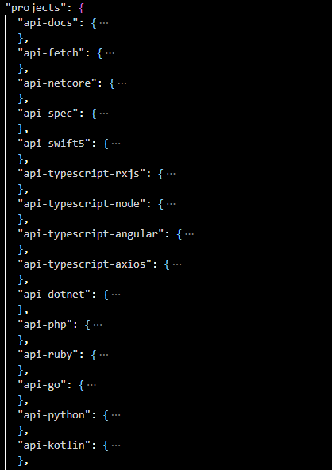

# How to generate open-api sdk for different client-side languages

First off, we use an nx-plugin called `@trumbitta/nx-plugin-openapi` to help us utilize the [open-api-generator](https://openapi-generator.tech/docs/generators/) in order to generate client sdk from `swagger.json` file

The swagger file is kept here --> `libs\api-spec\src\api-spec.openapi.json`

please make sure you replace the servers inside the json or re-check if its correct!

```json
 "servers": [
    {
      "url": "https://openapi.flowaccount.com/sandbox",
      "description": "The sandbox server"
    },
    {
      "url": "https://openapi.flowaccount.com/v3-alpha",
      "description": "The prod server"
    }
  ],
```

Currently we are setup to generate these sdk, right or wrong still have to be tested.



Before doing anything! run `yarn --frozen-lockfile`

## Example for generating typescript-axios sdk

you simply need to run `yarn nx run api-typescript-axios:custom-generate-sources` and the source will be generated into `libs\api-typescript-axios\src\` folder.

If you want to publish and have the permission to, you simply login into and publish npm using CLI or GUI after fixing the `libs\api-typescript-axios\package.json` file to a new version.