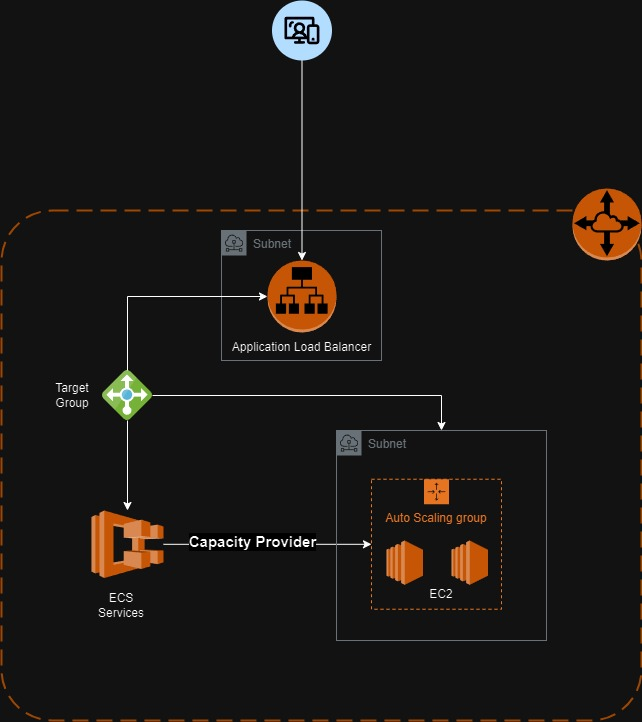
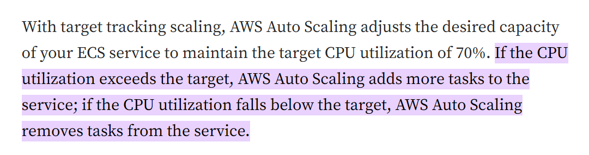

# ECS Cluster

An ECS (Elastic Container Service) is a type of docker container orchestration provided by AWS
[ECS](https://aws.amazon.com/ecs/)

At FlowAccount we utilizes it for our docker orchestration same as EKS, Google Kubernetes, Azure Kubernetes and Redhat Openshift etc.

Here is our story...

## Infrastructure Diagram




### Auto scaling specifications

CPUUtilization: 75%



for more types [read here...](https://mafiaguy.medium.com/a-complete-guide-on-how-to-autoscale-your-ecs-based-application-using-cdk-36d5e0ec46da#:~:text=If%20the%20CPU%20utilization%20exceeds,based%20on%20a%20specific%20metric)

### EC2 Specifications
type: t4g.medium
X Services
1 instance > 2 tasks
min: 1 instance
max: 2 instance

## Operations


### Deploying Infrastructure

**cdk boostrap**
```bash
yarn cdk bootstrap aws://778529894665/us-east-1 --profile=lab
```

**Deploying policies**

```bash
# ec2 instance policy
yarn nx run ecs-cluster:deploy-ecs-service --configuration=instance-policy-public-sandbox --profile=dev_console --stage=sandbox --serviceName=public-workshop
# task execution policy
yarn nx run ecs-cluster:deploy-ecs-service --configuration=task-execution-policy-public-sandbox --profile=dev_console --stage=sandbox --serviceName=public-workshop
# service/task policy
yarn nx run ecs-cluster:deploy-ecs-service --configuration=task-policy-public-sandbox --profile=dev_console --stage=sandbox --serviceName=public-workshop
```

**Deploying ECS Cluster and Auto-scaling groups**

```bash
# cluster
yarn nx run ecs-cluster:deploy-ecs-service --configuration=cluster-public-sandbox --profile=dev_console --stage=sandbox --serviceName=public-workshop

# asg
yarn nx run ecs-cluster:deploy-ecs-service --configuration=public-sandbox-cluster-default-asg --profile=dev_console --stage=sandbox --serviceName=public-workshop --keyPairName=fadev
```

**Finally! Deploying The ECS Service and Task!**

```bash
yarn nx run ecs-cluster:deploy-ecs-service --profile=dev_console --configuration=cluster-public-sandbox --stackName=public-workshop-sandbox-service --stage=sandbox --serviceName=public-workshop --asgName=node-sandbox-cluster-default --cpu=512 --memory=400 --imageName=public-workshop-sandbox --targetGroupArn=arn:aws:elasticloadbalancing:ap-southeast-1:697698820969:targetgroup/public-sandbox-tg/6199e5e591c4c5bd --keyPairName=fadev
```

### Deploying Application

Using a CI like Github Actions, Jenkins, or other tools you can simply push the image to AWS and update the service to force rolling deployment!

**Command to push image to aws ECR**

```bash
docker build . -t xxxxxxx.dkr.ecr.ap-southeast-1.amazonaws.com/flowaccount/public-workshop-sandbox:latest-public-workshop-sandbox
aws ecr get-login-password --region ap-southeast-1 --profile prod_console | docker login --username AWS --password-stdin xxxxxxx.dkr.ecr.ap-southeast-1.amazonaws.com
docker push xxxxxx.dkr.ecr.ap-southeast-1.amazonaws.com/flowaccount/public-workshop-sandbox:latest-public-workshop-sandbox
```

**Command to update service for redeployment of the tasks**

```bash
aws ecs update-service --force-new-deployment --cluster  node-sandbox-cluster --service ${ECS_SERVICE_NAME} --desired-count 1 --region ap-southeast-1 --profile dev_console
```


